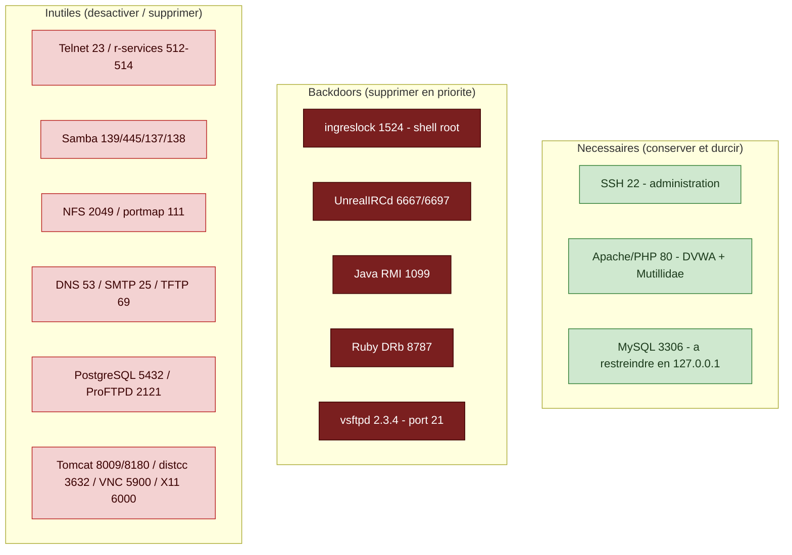
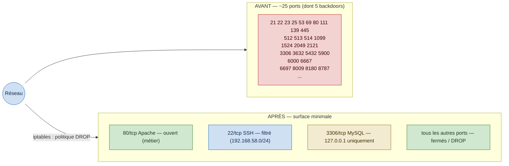
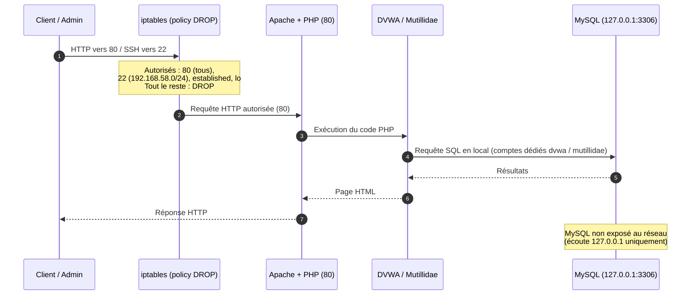

---
**Sécurité des systèmes d'exploitation et des réseaux**

# Travail pratique n° 3
## Analyse et durcissement d'un serveur Linux

| | |
|---|---|
| **Système cible** | Metasploitable 2 (Ubuntu 8.04 LTS) |
| **Document** | Note de synthèse |
| **Auteur** | Prénom NOM |
| **Date** | Juin 2026 |
| **Version** | 1.0 |
| **Diffusion** | Usage pédagogique — réseau isolé |

---

## 1. Objet du document

Ce dossier présente l'analyse de la surface d'attaque et le durcissement d'une
machine **Metasploitable 2** (Ubuntu 8.04 LTS) hébergeant deux applications web
délibérément vulnérables, DVWA et Mutillidae, qui doivent demeurer fonctionnelles.

La machine étant volontairement vulnérable et hébergeant des portes dérobées
actives, son utilisation est strictement réservée à un réseau isolé (hôte seul ou
NAT). Les mots de passe figurant dans ce dossier sont des valeurs de remplacement.
L'objectif n'est pas de corriger l'ensemble des vulnérabilités — ce qui n'est ni
réalisable (système en fin de vie, applications vulnérables par conception) ni
demandé — mais de réduire la surface d'attaque et de durcir le système en cohérence
avec son rôle.

## 2. Contexte technique

Ubuntu 8.04 repose sur SysVinit, complété par xinetd et inetd (commandes `service`,
`update-rc.d`, fichiers `/etc/xinetd.d`, `/etc/inetd.conf`). Le pare-feu repose sur
iptables, le noyau étant antérieur à nftables. L'énumération s'effectue avec
`netstat` et `ifconfig`. Les dépôts APT étant fermés, les composants ne sont pas
corrigeables ; la migration vers un système supporté constitue la correction de
fond.

## 3. Composition du dossier

| Élément | Description |
|---|---|
| `01_analyse.md` | Cartographie du système et analyse de la surface d'attaque |
| `02_plan_durcissement.md` | Plan de durcissement (état initial, mesures, vérification, état final) |
| `diagrams/` | Sources des schémas au format Mermaid |
| `captures/` | Captures d'écran (preuves visuelles) et guide d'acquisition |

## 4. Synthèse des mesures appliquées

| N° | Mesure | Incidence sur le service |
|---|---|---|
| 1 | Neutralisation des portes dérobées (ingreslock, UnrealIRCd, Java RMI, Ruby DRb, vsftpd) | Aucune |
| 2 | Suppression des services superflus (Samba, NFS, BIND, PostgreSQL, Tomcat, distcc, ProFTPD, Postfix) | Aucune |
| 3 | Restriction de MySQL à l'écoute locale (127.0.0.1) | Aucune |
| 4 | Authentification SSH par clé, interdiction du superutilisateur, SSHv2 imposé | Administration par clé |
| 5 | Pare-feu iptables, politique de rejet par défaut (80 ouvert, 22 restreint) | Aucune |
| 6 | Changement du mot de passe par défaut, verrouillage des comptes faibles | Aucune |
| 7 | Durcissement d'Apache et de MySQL, comptes applicatifs dédiés | Applications préservées |
| 8 | Durcissement de /tmp, restriction des droits sensibles | Aucune |

La surface d'attaque passe d'environ vingt-cinq services exposés — dont cinq portes
dérobées donnant un accès *root* — à trois services nécessaires et durcis, DVWA et
Mutillidae demeurant fonctionnelles.

## 5. Schémas

Les sources éditables figurent dans le dossier `diagrams/`.

### 5.1 Services nécessaires, superflus et portes dérobées

### 5.2 Ports exposés avant et après durcissement

### 5.3 Flux d'une requête après durcissement

## 6. Périmètre et limites

Metasploitable 2 repose sur Ubuntu 8.04, en fin de vie : les dépôts APT sont fermés
et les composants (Apache, PHP, MySQL) ne sont pas corrigeables. La suppression de
l'ensemble des vulnérabilités n'est pas l'objet de ce travail — les applications
devant rester vulnérables et fonctionnelles — et n'est de toute façon pas atteignable
sur cette base. La correction de fond des versions relève d'une migration vers un
système supporté, qui constitue la recommandation principale.

---
*Document rédigé dans le cadre du module Sécurité des systèmes d'exploitation et des
réseaux.*
