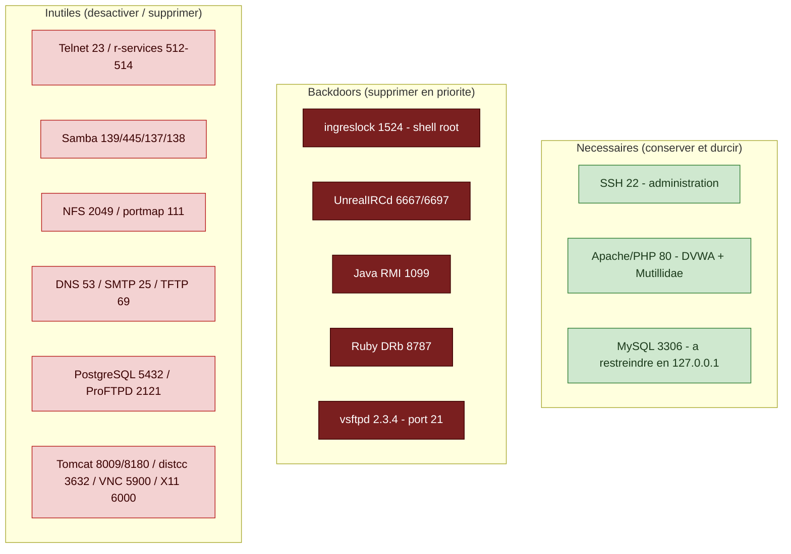
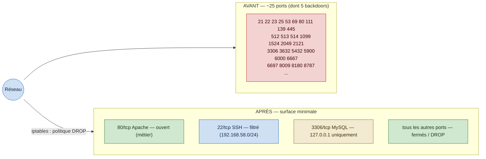
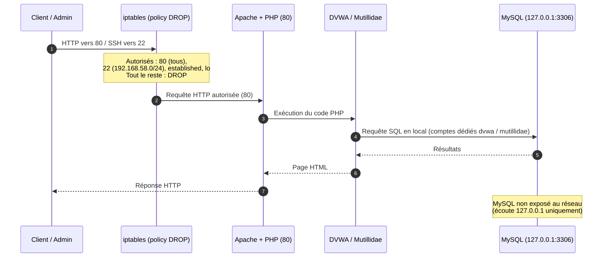

# TP3 — Durcissement d'un serveur Linux (Metasploitable 2)

Analyse de la surface d'attaque et durcissement d'une machine Metasploitable 2
(Ubuntu 8.04) hébergeant deux applications web volontairement vulnérables, DVWA et
Mutillidae, qui doivent rester fonctionnelles.

La machine étant délibérément vulnérable et hébergeant des backdoors actives, elle
ne doit être utilisée que sur un réseau isolé (Host-only ou NAT). Les mots de passe
de ce dépôt sont des placeholders. L'objectif n'est pas de corriger l'ensemble des
vulnérabilités, ce qui n'est ni possible (système en fin de vie, applications
vulnérables par conception) ni demandé, mais de réduire la surface d'attaque et de
durcir le système en cohérence avec son rôle.

## Contexte technique

Ubuntu 8.04 fonctionne avec SysVinit, xinetd et inetd (service, update-rc.d,
/etc/xinetd.d, /etc/inetd.conf). Le pare-feu repose sur iptables, le noyau étant
antérieur à nftables. L'énumération s'effectue avec netstat et ifconfig. Les dépôts
APT étant fermés, les composants ne sont pas corrigeables ; la migration vers un
système supporté constitue la correction de fond.

## Structure du dépôt

| Fichier | Description |
|---|---|
| [01_analyse.md](01_analyse.md) | Cartographie du système et analyse de la surface d'attaque |
| [02_plan_durcissement.md](02_plan_durcissement.md) | Plan de durcissement (état initial, mesures, vérification, état final) |
| [diagrams/](diagrams/) | Sources Mermaid des schémas |

## Mesures appliquées

| Thème | Mesure | Impact métier |
|---|---|---|
| 1 | Neutralisation des backdoors (ingreslock, UnrealIRCd, RMI, DRb, vsftpd) | aucun |
| 2 | Suppression des services inutiles (Samba, NFS, BIND, PostgreSQL, Tomcat, distccd, ProFTPD, Postfix) | aucun |
| 3 | MySQL restreint à l'écoute locale (127.0.0.1) | aucun |
| 4 | SSH par clé, root interdit, SSHv2 | administration par clé |
| 5 | Pare-feu iptables, politique DROP (80 et 22 restreint) | aucun |
| 6 | Mot de passe par défaut changé, comptes faibles verrouillés | aucun |
| 7 | Apache et MySQL durcis, comptes applicatifs dédiés | applications préservées |
| 8 | /tmp durci, droits sensibles restreints | aucun |

La surface d'attaque passe d'environ vingt-cinq services exposés, dont cinq
backdoors root, à trois services nécessaires durcis, DVWA et Mutillidae restant
fonctionnelles.

## Schémas

Les sources éditables sont dans le dossier [diagrams/](diagrams/).

### Services necessaires, inutiles et backdoors

### Ports exposes avant et apres durcissement

### Flux d'une requete apres durcissement

## Auteur

Raian Remir — TP3 Sécurité des OS et des réseaux

